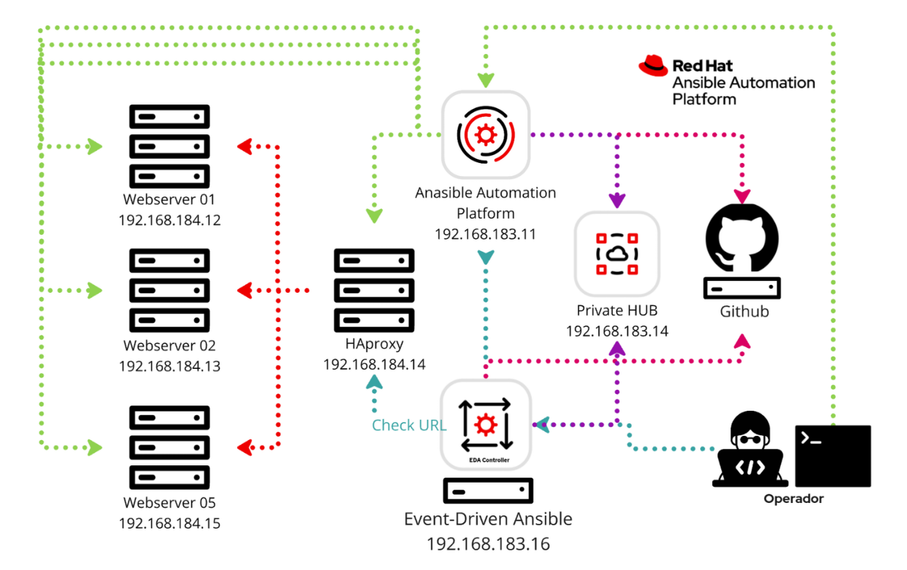

# Configuration as Code

## Architecture

## Create Vars file

### Example of vaults files

#### Vault example configuration_automation_controller

    controller_username: admin
    controller_password: <senha do controller>
    controller_hostname: controller01.localnet.local
    controller_validate_certs: false
    gitlab_consulting_user: lagomes
    gitlab_consulting_token: <token de acesso ao projeto>
    automationhub_username: lagomes
    automationhub_password: <senha do hub>
    redhat_user: <user da redhat>
    redhat_pass: <senha do redhat>
    ldap_pass: <senha do ldap dev>
    redhat_user_dev: <user da redhat>
    redhat_pass_dev: <senha do redhat>
    ldap_pass_dev: <senha do ldap dev>

#### Vault example configuration_automation_hub

    config_hub_automationhub_url: https://automationhub01.localnet.local
    config_hub_automationhub_username: admin
    config_hub_automationhub_password: <senha do controller>
    redhat_username: <user da redhat>
    redhat_password: <senha do redhat>
    automationhub_token: <token do automation hub da redhat>

#### Vault example configuration_automation_eda

    validate_certs: false
    eda_username: admin
    eda_password: <senha do eda>
    eda_host: https://eda.localnet.local
    controller_username: admin
    controller_password: <senha do controller>
    controller_host: controller01.localnet.local
    gitlab_consulting_user: lagomes
    gitlab_consulting_token: <token de acesso ao projeto>

## Comandos no shell
### configuration_automation_controller
    ansible-playbook main_read.yml --ask-vault-pass -e orgs=Default -e env=prod
    ansible-playbook main_read.yml --ask-vault-pass -e orgs=Default -e env=dev
    ansible-playbook main_read.yml --ask-vault-pass -e orgs=devops -e env=prod

### configuration_automation_eda
    ansible-playbook main.yml --ask-vault-pass 

### Apply configuration_automation_hub
    ansible-playbook main.yml --ask-vault-pass 

## Comandos no ansible Navigator

### Ansible Navigator configuration_automation_controller
    export ANSIBLE_VAULT_PASSWORD_FILE=.pass
    ansible-navigator run configuration_automation_controller/main_create.yml -e orgs=Default -e env=dev --pass-environment-variable ANSIBLE_VAULT_PASSWORD_FILE
    ansible-navigator run configuration_automation_controller/main_create.yml -e orgs=Default -e env=prod --pass-environment-variable ANSIBLE_VAULT_PASSWORD_FILE
    ansible-navigator run configuration_automation_controller/main_create.yml -e orgs=devops -e env=prod --pass-environment-variable ANSIBLE_VAULT_PASSWORD_FILE

### Ansible Navigator configuration_automation_eda
    export ANSIBLE_VAULT_PASSWORD_FILE=.pass
    ansible-navigator run configuration_automation_eda/main.yml --pass-environment-variable ANSIBLE_VAULT_PASSWORD_FILE

### Ansible Navigator configuration_automation_hub
    export ANSIBLE_VAULT_PASSWORD_FILE=.pass
    ansible-navigator run configuration_automation_hub/main.yml --pass-environment-variable ANSIBLE_VAULT_PASSWORD_FILE
